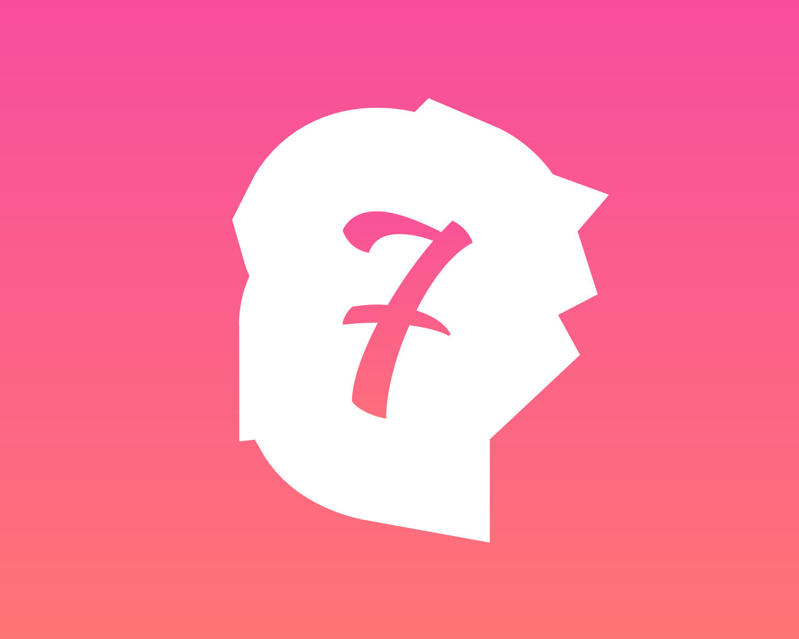

<h1 align="center">
  <br>
  <a href="https://github.com/lidongsevenlee/seven-island"></a>
  <br>
  Seven Island
  <br>
</h1>

macOS 刘海增强工具，将 MacBook 的刘海变成一个动态控制中心，集音乐控制、日历、文件架、剪贴板历史、HUD 替换等功能于一身。

## 安装

**系统要求：** macOS 14 Sonoma 或更高版本

### 方式一：下载安装

从 [Releases](https://github.com/lidongsevenlee/seven-island/releases) 下载最新版 DMG 并安装。

### 方式二：从源码构建

```bash
git clone https://github.com/lidongsevenlee/seven-island.git
cd seven-island
open boringNotch.xcodeproj
```
在 Xcode 中按 `Cmd + R` 构建并运行。
